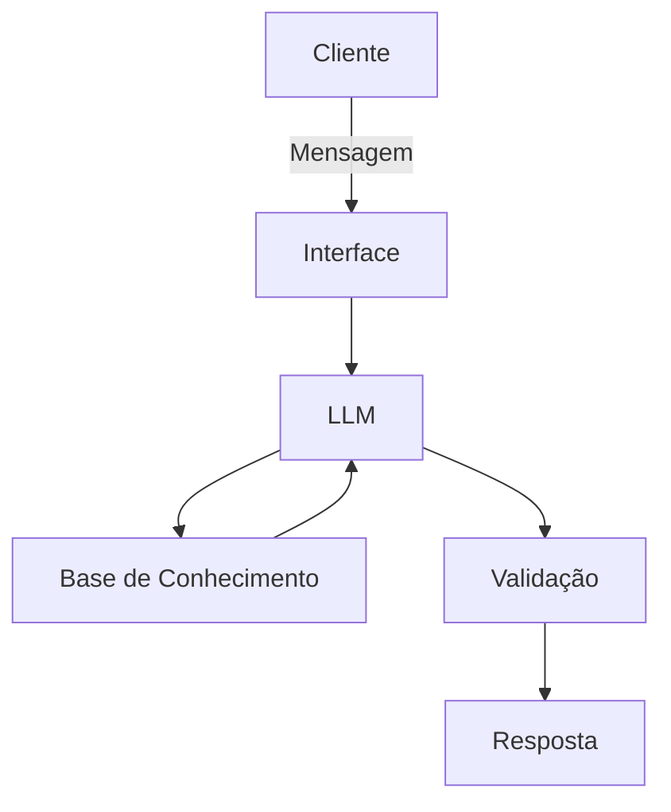

# Documentação do Agente

## Caso de Uso

### Problema
> Qual problema financeiro seu agente resolve?

Este agente visa tratar uma das dores do Bradesco .A inadimplência no crédito de varejo que acabam gerando custos operacionais:
Custos de cobrança, risco de crédito, perda de relacionamento com o cliente gerando um impacto negativo na experiência do usuário e no ROI do banco.Ainda tem aumento no PDD(previsão de Devedores duvidosos). 

Muitos clientes não pagam suas faturas ou parcelas por problemas temporários de fluxo de caixa, não por incapacidade financeira permanente. tratando esta dor meu chat pode ajudandar a almentar receita . antecipando o problema que hoje pode estar sendo tratado de forma retiva.

### Solução
> Como o agente resolve esse problema de forma proativa?

O agente atua como um Assistente Financeiro Preventivo, monitorando dados simulados de saldo e compromissos financeiros do cliente.
Quando identifica um possível risco de inadimplência (ex: saldo menor que valor da fatura próxima do vencimento), o agente:
Detecta o risco financeiro com base nos dados, inicia contato proativo com linguagem empática a partir dai segue com estes passos : 

1° - Oferece opções personalizadas de renegociação ou parcelamento.(se estiver dentro das politicas do Banco).

2° -Explica de forma simples os benefícios da decisão preventiva.( Sugiro usar uma linguagem que tenha um CTA)

3° -Simula cenários financeiros para ajudar na decisão.

4° Dentro do contexto a IA dará respostas humanizadas, personalizadas e contextualizadas, aumentando a taxa de aceitação das soluções.

### Público-Alvo
> Quem vai usar esse agente?

O foco deve ser adultos entre 25 e 45 anos com renda ativa e uso frequente de crédito, especialmente clientes com:
Uso recorrente de cartão de crédito, financiamentos ou empréstimos ativos e histórico financeiro positivo, mas com oscilações de fluxo de caixa.
Ainda se possivel mantendo o funil em clientes com alta familiaridade com canais digitais

## Persona e Tom de Voz

### Nome do Agente
Ana — Assistente Financeira Preventiva

### Personalidade
> Como o agente se comporta? (ex: consultivo, direto, educativo)

Empático, consultivo, preventivo, educativo, orientando a soluçuções cabiveis não julgador 

### Tom de Comunicação
> Formal, informal, técnico, acessível?

Tom acessível, humano e profissional, com linguagem simples e clara, evitando termos técnicos complexos. 

### Exemplos de Linguagem
- Saudação: [ex: "Olá! Como posso ajudar com suas finanças hoje?"]
- Confirmação: [ex: "Entendi! Deixa eu verificar isso para você."]
- Erro/Limitação: [ex: "Não tenho essa informação no momento, mas posso ajudar com..."]

-Saudação :  Olá, João! Meu nome é Ana e percebi que você tem uma conta importante vencendo em breve. Posso te ajudar a organizar isso da melhor forma.

-Confirmação : Entendi. Vou verificar algumas opções que podem aliviar seu orçamento este mês.

-Erro/Limitação: No momento não tenho dados suficientes para calcular isso com precisão, mas posso te explicar as opções disponíveis.

## Arquitetura

### Diagrama

### Componentes

| Componente | Descrição |
|------------|-----------|
| Interface | [ex: Chatbot em Streamlit] |
| LLM | [ex: Modelo local via Ollama (ex: Llama 3 ou Mistral 7B ou Phi-3 Mini)] |
| Base de Conhecimento | [ex: JSON/CSV com dados do cliente] |
| Validação | [ex: Checagem de alucinações] |

---

## Segurança e Anti-Alucinação

### Estratégias Adotadas

- [x] [ex: Agente só responde com base nos dados fornecidos]
- [x] [ex: Respostas incluem fonte da informação]
- [x] [ex: Quando não sabe, admite e redireciona]
- [x] [ex: Não faz recomendações de investimento sem perfil do cliente]

### Limitações Declaradas
> O que o agente NÃO faz?

-Não acessa dados bancários senciveis 

-Não realiza operações financeiras reais

-Não fornece aconselhamento jurídico ou tributário

-Não possui certificação proficional(tipo/Ancor/CPA10/20)

-Não garante aprovação de crédito

-Não toma decisões automáticas sem confirmação do usuário
